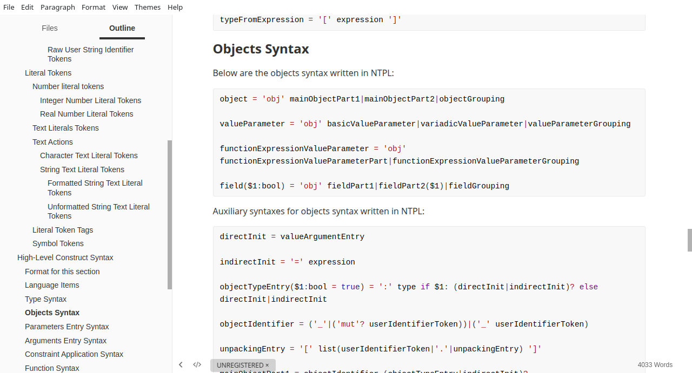

# Nc Programming Language Official Specification

This document defines the formal specifications of the nc programming language, the specification that would be used to write the compiler and interpreter of the nc programming language. As inferred from the previous statement, nc programming language is built to work for both compilation and an odd form of interpretation which would be discussed at length in this document. Unlike most formal specifications, this document is written in a beginner friendly way to facilitate faster understanding of the document for persons that have met the criteria of possessing rudimentary knowledge in programming concepts, NTPL and compiler development.

It is encouraged to read this specification document using a dedicated markdown editor or viewer like **Typora** (_what I use to write this specification document with the only downside being the code section has no setting to turn off code wrapping_) other than to read this specification document on github, because it honestly looks ugly on github. I also currently use bat as the language of choice for the NTPL code sections because NTPL does not yet have syntax highlighting.

An example of the Typora interface:



The official acronym of the programming language is **NPL** which stands for **N**c **P**rogramming **L**anguage - obviously - and the official source code file extension is `.npl`.

To describe the text representation of the nc programming language, nc's very own text processing language is used, called **nc text processing language**  and referred to as **NTPL** in this document. You are advised to read the tutorial for the text processing language before reading this document.

NPL is comprised of four basic parts, like all programming languages, which are:

1. Comments
2. Tokens
3. High-level construct syntax
4. High-level construct semantics

Comments are informal constructs ignored by the language used to convey expression of thought, intent or ideas in code, tokens are the fundamental units of the language, high-level construct syntax describe the high-level language constructs built from tokens and high-level construct semantics details the meaning of the various syntax, where they are expected to be, their use and their low-level implementation. To implement greater understanding of this document and to keep with the promise of it being written in a beginner friendly way, the four basic parts would be explained one after the other while enumerating their co-dependence.

## Comments

Like was previously said, comments are informal constructs ignored by the language used to convey expression of thought, intent or ideas in code. They are referred to as informal because they are not a formal feature of the language that has any impact on the compilation of code because they are ignored by the language after a certain phase of compilation. Their main purpose it to convey your expression of thought to yourself in the future and other programmers going over your code, convey your intent over a particular section of code to others and convey ideas used in the planning of the writing of code.

Comments are generally categorized into two in programming, that is:

- Single-line comments
- Multi-line comments

With their names already been self descriptive, single-line comments are comments that span a single-line while multi-line comments are comments that span multiple lines.

There are two types of comments in NPL, namely:

- Discard comments
- Document comments

### Discard Comments

Are comments that are simply discarded by the compiler and interpreter after the fact (_generally after the tokenization phase of the compiler or a special comment parsing phase before tokenization_). 

Based on the categories of comments, there are two type of discard comments, namely:

- Single-line discard comments
- Multi-line discard comments

#### Single-Line Discard Comments

Below is the single-line discard comments syntax written in NTPL:

```bat
singleLineDiscardComment = '>! ' any*
```

Examples of the above syntax would be:

```
>! Writing a signle-line comment
>! obj x = 34
>! 
```

#### Multi-Line Discard Comments

Below is the multi-line discard comments syntax written in NTPL:

```bat
multiLineDiscardComment = '<\'' any* '\'>'
```

An example of the above syntax would be:

```
<'
	comment
	spanning
	muliple
	lines
'>
```

### Document Comments

Are comments that are retained by the compiler and interpreter after the fact (_generally after the tokenization phase of the compiler or a special comment parsing phase before tokenization_). Reason being that document comments serve the purpose of writing documentations or meaningful text that help describe the intent of code. Therefore, all document comments are retained by the compiler and interpreter to be used in generating documentations of code when prompted by the user, further explanation would be given in the semantic section.

Based on the categories of comments, there are two types of document comments, namely:

- Single-line document comments
- Multi-line document comments

#### Single-Line Document Comments

Below is the single-line document comment syntax written in NTPL:

```bat
singleLineDocumentComment = '>: ' any*
```

Examples of the above syntax would be:

```
>: This code performs heterogeneous independent computations simultaneously
>: Only god knows what this code means, sorry 😭
```

#### Multi-Line Document Comments

Below is the multi-line document comments syntax written in NTPL:

```bat
multiLineDocumentComment = '<"' .* '">'
```

An example of the above syntax would be:

```
<"
	Given the inception of SIMD intrisntics, this code is due to change to use the new
	technology that promises more speed when operating on large datasets such as this,
	but due to my chronic laziness, I would not be able to implement such change until
	the end of the year. Besides, I don't get paid for any of this, so do not flood my
	emails or telegram with texts of the implementation :).
">
```

## Tokens

Like was previously said, tokens are the fundamental units in the nc programming language, they comprise of a set of unicode characters that have a predefined purpose in the nc programming language.

There are 3 types of tokens, namely:

1. Identifier tokens
2. Literal tokens
3. Symbol tokens

### Identifier Tokens

Are tokens that make use of a set of unicode characters that can be combined to form text that depends on a *speaking* language and the context it is written in. Below is the basic identifier syntax written in NTPL:

```bat
basicIdentifierToken = '_'|Script ('_'|Script|'0'~'9')*
```

Examples of the above syntax would be:

```
i_love_myself
我爱我自己
私は自分自身を愛している
Я_люблю_себя
Kendimi_seviyorum
Me_quiero
أنا_أحب_نفسي
__delta__
_123456
km1
km_8
```

There are two types of Identifier tokens, namely:

1. Language identifier tokens
2. User identifier tokens

#### Language Identifier Tokens

Are the set combination of unicode characters that are reserved for use by the language. Below are the language identifier tokens:

- `scope`
- `contract`
- `impl`
- `struct`
- `union`
- `valueDef`
- `unique`
- `obj`
- `type`
- `fn`
- `marco`
- `break`
- `continue`
- `true`
- `false`
- `addressof`
- `and`
- `or`
- `not`
- `xor`
- `mut`
- `from`
- `eq`
- `lt`
- `gt`
- `if`
- `else`
- `while`
- `for`
- `match`
- `with`
- `in`
- `import`
- `apply`
- `r`
- `use`
- `_`
- `outer`
- `end`
- `variadic`
- `at`
- `exp`
- `ty`
- `misc`
- `operator`

---

Obviously the NTPL function for language identifier tokens is `languageIdentifierToken` equal to the language identifier tokens list above, but since they are too much, I am not going to write the NTPL it, just imply it.

#### User Identifier Tokens

Are the rest of the set combination of unicode characters that the user can make use of.

##### Raw User Identifier Tokens

To eliminate the restriction that only allows the use of a small set of unicode characters to be used in writing identifiers and also the restriction of reserving a set combination of identifiers for the language, NPL has something called raw user identifier tokens.

There are two types of raw user identifier tokens, namely:

- Raw user language identifier tokens
- Raw user string identifier tokens

###### Raw User Language Identifier Tokens

Are raw user identifier tokens that allow the entry of language identifiers as user identifiers. Below is the syntax written in NTPL:

```bat
rawLanguageIdentifierToken = 'r\''languageIdentifierToken
```

Examples of the above syntax would be:

```
r'struct
r'union
r'scope
```

###### Raw User String Identifier Tokens

Are raw user identifier tokens that allow the entry of any unicode character to form an identifier, provided it does not form into a basic identifier token. Below is the syntax written in NTPL:

```bat
rawUserIdentifierToken = 'r'stringTextLiteralToken
```

> stringTextLiteralToken is covered in the string text literal token section under the literal token section

Examples of the above syntax would be:

```
r"Happy Birthday 🎂"
r"🦍"
r"is car flying?"
```

As earlier stated, a raw user identifier token must not form into a basic identifier. This is done because raw user string identifiers were introduced solely to supplement user identifier entry, and since there already exist basic identifiers, having another identifier type form into a basic identifier just leads to confusion. Therefore something like the below is not allowed:

```
r"come_and_go_by_yeat"
r"Travis_Scott"
r"isThisTrue"
```

Besides, anything else goes in a raw user string identifier token entry, a user can start identifiers with numbers `r"1Egg"`, include whitespace unicode characters `r"1 Egg"`  and have fun with emojis `r"🕵 is 👁 at 🫵🏿"`. The sky is literally your limit with raw user string identifier tokens.

---

Subsequently, the NTPL function for identifier tokens is:

```bat
identifierToken = languageIdentifierToken|userIdentifierToken
```

With `userIdentifierToken` encompassing the remaining set combination of unicode characters and raw user identifier tokens.

### Literal Tokens

Are tokens that make use of a set of unicode characters that can be combined to form semantic constant values.

There are two types of literal tokens, namely:

- Number literal tokens
- Text literal tokens

#### Number literal tokens

Are tokens that allow the entry of numbers in NPL. Number literal tokens in NPL are positional numeral system numbers that support bases `2` to `36` and digit separators(`_`). Due to the fact that number literal tokens in NPL support bases `2` to `36`, unicode characters `A` to `Z` are valid digits. Detailed explanation of positional numeral system can be found in [**TODO: create a document to explain positional numeral systems**]. Below is the digits and base entry syntax written in NTPL:

```bat
digits = '0'~'9'|'A'~'Z'

base = ₂~₃₆
```

The default base of a number literal when no base is specified is base `10`.

There are two types of number literal tokens, namely:

- Integer number literal tokens
- Real number literal tokens

##### Integer Number Literal Tokens

Are number literal tokens that allow the entry of whole numbers (_all digits including zero_). Below is the syntax written in NTPL:

```bat
integerNumberLiteralToken = '0'~'9' ('_'? digits)* base?
```

Examples of the above format would be:

```
10_000
3J5L₂₂
0FF_90₁₆
0DDN₂₅
10_000₁₉
```

Because of the need to disambiguate between identifiers and numbers, digits `0` to `9` are expected as the first digit in an integer number literal token entry, so writing the hexadecimal number `AB4₁₆` would be `0AB4₁₆`.

##### Real Number Literal Tokens

Are number literal tokens that allow the entry of rational numbers (_fractional numbers, numbers that are represented as a ratio of two integers_) and irrational numbers (_non fractional numbers - numbers that cannot be represented as a ratio of two integers_).

Real number literal tokens can either be written in either normal fractional number form `0.0003` or scientific notation form `3.0@-4` or `3@-4`. Because number literal tokens in NPL support bases `2` to `36`, the exponent base indicator is  `@` unicode character not the conventional `e` or `E` with the exponent base being the number after the exponent base indicator. Since the exponent base refers to the count of digits to move the fractional point by, the language only parses for base 10 digits as the exponent base which is then used to refer to the exact number of digits to move the fractional point by. Below is the real number literal token and exponent syntax written in NTPL:

```bat
realNumberLiteralToken = '0'~'9' ('_'? digit)* '.' digit ('_'? digit)* base? exponent?

exponent = '@' '-'? '0'~'9'+
```

Examples of the above format would be:

```
23.34
2.345@-90
0.34₈
2G.KL₂₈@2
```

#### Text Literals Tokens

Are literal tokens that allow the entry of any unicode character and something called a text action in them.

#### Text Actions

Are a set combination of unicode characters starting with `\` unicode character that instructs the language to perform a particular action in the text literal token. Below are the syntax list of the various text actions written in NTPL:

- `r'\n'` : inserts the newline unicode character

- `r'\t'` : inserts the horizontal tab unicode character

- `r'\e'` : inserts the escape unicode character

- `r'\r'` : inserts the carriage return unicode character

- `r'\"'` : inserts the apostrophe unicode character

- `r'\\'` : inserts the `\` unicode character

- `r'\'WhiteSpace+` : discards any whitespace character till a non whitespace character is found

- `r'\'unicode_character_codepoint` : allows the entry of unicode characters using their code-points

  - ```bat
    unicode_character_codepoint = '['integerNumberLiteralToken']'
    ```

    Example of the above format would be `\[345]`

    > **NOTE**: when no base is specified for the integer number literal token, instead of defaulting to base 10 like the default for number literal tokens, the language defaults to base 16, this is to better reflect the prominent base used in specifying code-points in unicode

- `r'\'unicode_character_name` : allows the entry of unicode characters using their names

  - ```bat
    unicode_character_name = '{'basicIdentifierToken (' '|'-' basicIdentifierToken)*'}'
    ```
    
    Example of the above format would be `\{face with crossed-out eyes}` which is the 😵 unicode character.

Subsequently, the NTPL function of text action is `text_action` equal to the various text actions above.

---

There are two types of text literal tokens, namely:

- Character text literal token
- String text literal token

##### Character Text Literal Tokens

Are text literal tokens that allow the entry of exactly one unicode character or text action that results in a unicode character. Below is the syntax written in NTPL:

```bat
characterTextLiteralToken = '\'' any|text_action '\''
```

Examples of the above format would be:

```
'\n'
'e'
'ざ'
'🌉'
'Ǽ'
'\                      E'
'엓'
```

Character text literal token allows the entry of the `'` character by just specifying three `'` characters like so `'''` and the entry of `\` without the text action by just specifying one `\` like so `'\'`, these are all possible due to the fact that character text literal tokens expect only one unicode character.

##### String Text Literal Tokens

Are text literal tokens that allow the entry of zero or more unicode characters. There are two types of string text literal tokens, namely:

- Formatted string text literal tokens
- Unformatted string text literal tokens

###### Formatted String Text Literal Tokens

Are string text literal tokens that support the entry of text actions. Below is the syntax written in NTPL:

```bat
formattedStringTextLiteralToken = '"' (any|text_action)* '"'
```

Examples of the above format would be:

```
"\r\n"
"
I love me\
some good 🐔
"
"scarf(🧣) or sari(🥻)?"
""
"\n㒐㦀\n"
```

###### Unformatted String Text Literal Tokens

Are string text literal tokens that do not support the entry of text actions, meaning text actions simply have no effect in the string text literal token. Below is the syntax written in NTPL:

```bat
unFormattedStringTextLiteralToken = '#'{n} '"' .* '"' '#'{n}
```

> Remember, the curly brace operator in the above NTPL asks for at least one or exactly **n** iterations of the unicode character **#**, meaning the number of both **#** must be the same

Examples of the above format would be:

```
#"Collectivism is the enemy of Individualism"#
##" "# "# "##
#"\n\\r\r\r\r\r\r\r\r\rn"#
```

---

Subsequently, the NTPL function of string text literal token is:

```bat
stringTextLiteralToken = formattedStringTextLiteralToken|unformattedStringTextLiteralToken
```

#### Literal Token Tags

Are simply marker identifiers that specify the type of literal tokens in NPL (_more in the semantic section_). Below is the number literal token and text literal token syntax with their literal token tag specifications written in NTPL:

```bat
numberLiteralToken = integerNumberLiteralToken|realNumberLiteralToken '\'' identifierToken

textLiteralToken = identifierToken characterTextLiteralToken|stringTextLiteralToken
```

#### Symbol Tokens

Are the remaining set of unicode characters that are used in the language. They are called symbols because the language uses them as such and unlike identifier and literal tokens, individual symbol tokens are fixed and not extendable. Below are the unicode characters that form the list of symbol tokens:

- `+`
- `-`
- `%`
- `*`
- `/`
- `^`
- `=`
- `:=`
- `+=`
- `-=`
- `=-`
- `*=`
- `/=`
- `=/`
- `%=`
- `=%`
- `^=`
- `!`
- `~`
- `~.`
- `:`
- `(`
- `)`
- `{`
- `}`
- `[`
- `]`
- `&`
- `#`
- `@`
- `$`
- `=>`
- `->`
- `~>`
- `->>`
- `,`
- `.`
- `;`
- `..`
- `?`
- `.[`

---

Obviously the NTPL function for symbol tokens is `symbolToken` equal to the symbol tokens list above, but since they are too much, I am not going to write it, just imply it.

## High-Level Construct Syntax

Like was previously said, high-level construct syntax describe the high-level language constructs built from tokens. The following are the various high-level construct syntax in NPL:

- File contents
- Type syntax
- Objects syntax
- Parameters entry syntax
- Arguments entry syntax
- Constraint application syntax
- Function syntax
- Marco syntax
- Type creators syntax
- Contract syntax
- Impl syntax
- Scope syntax
- Expressions syntax
- Block syntax
- Statement syntax
- LCIs (_Language Communication Interfaces_) syntax
- Import syntax
- Use syntax
- Groupings syntax


Needed NTPL function in this section:

```bat
list($1:exp, $2:exp = ',', $3:op = `*`) = $1 ($2 $1)`$3`
```

### Format for this section

Unlike the comment and token sections, this section has a fixed format for how the information of the various syntaxes would be presented. First would be the syntax of the high-level construct in NTPL, second would be the auxiliary syntax in NTPL, if any, that would be used to display additional helper syntaxes directly linked to the high-level construct, third and finally would be the supplementary info, if any, that includes additional essential information that cannot be represented in NTPL or is better represented in textual format on the parsing of the high-level construct syntax.

The format of this section shown in NTPL for fun:

```bat
highLevelConstructSyntaxSection = primarySyntax auxiliarySyntax? supplementaryInfo?
```

 Obviously, the above NTPL function has no real purpose in this NPL specification other than to describe the format of this section.


### File Contents

Are the various high-level construct syntaxes that are allowed  in the high-level construct syntax level to be written in an NPL source code file. Below is the NTPL for it:

```bat
fileContent = (object|function|marco|scope|import|contract|typeCreator)*
```

### Type Syntax

Below is the type syntax written in NTPL:

```bat
type($1:bool = true) = basicType($1)|functionType|contractType|valueReference|memoryAddressReferenceType|typeLCI|typeFromExpression
```

Auxiliary syntaxes for types syntax written in NTPL:

```bat
basicType($1:bool) = scopedIdentifier typeArgumentEntry($1)? comptimeValueArgumentEntry?

functionType = 'fn' '(' list(type) ')' type|'!'

contractType = '!' ('mut'? '&')? functionType|(userIdentifierToken typeArgumentEntry?)

valueReferenceType = 'mut'? '&'|'{&}' type

memoryAddressReferenceType = 'mut'? '*'|'{*}' type

typeFromExpression = '[' expression ']'
```

### Objects Syntax

Below are the objects syntax written in NTPL:

```bat
object = 'obj' mainObjectPart1|mainObjectPart2|objectGrouping

valueParameter = 'obj' basicValueParameter|variadicValueParameter|valueParameterGrouping

functionExpressionValueParameter = 'obj' functionExpressionValueParameterPart|functionExpressionValueParameterGrouping

field($1:bool) = 'obj' fieldPart1|fieldPart2($1)|fieldGrouping
```

Auxiliary syntaxes for objects syntax written in NTPL:

```bat
directInit = valueArgumentEntry

indirectInit = '=' expression

objectTypeEntry($1:bool = true) = ':' type if $1: (directInit|indirectInit)? else directInit|indirectInit

objectIdentifier = ('_'|('mut'? userIdentifierToken))|('_' userIdentifierToken)

unpackingEntry = '[' list(userIdentifierToken|'.'|unpackingEntry) ']'

mainObjectPart1 = objectIdentifier (objectTypeEntry|indirectInit)?

mainObjectPart2($1:bool = false) = 'mut'? unpackingEntry objectTypeEntry($1)|indirectInit

basicValueParameter = objectIdentifier|unpackingEntry ':' type(false) indirectInit?

variadicValueParameter = variadicValueParameterPart ':' '..'? type

variadicValueParameterPart = ('..' 'mut'? userIdentifierToken)|('_' '..' userIdentifierToken)

fieldPart1 = '..' 'mut'? userIdentifierToken ':' '..'? type

fieldPart2($1:bool) = 'mut'? if $1: userIdentifierToken|unpackingEntry else userIdentifierToken ':' type

functionExpressionValueParameterPart = objectIdentifier|unpackingEntry (':' type)?
```

### Parameters Entry Syntax

Below are the parameters entry syntax written in NTPL:

```bat
valueParameterEntry = '('list((attributeLCI? valueParameter))')'

comptimeValueParameterEntry = '!'.'('list((attributeLCI? valueParameter))')'

functionExpressionValueParameterEntry = '('list(functionExpressionValueParameter)')'

typeParameterEntry = '['list(typeParameter|variadicTypeParameter)']'
```

Auxiliary syntaxes for parameters entry syntax written in NTPL:

```bat
typeParameter = 'type' userIdentifierToken typeArgumentEntry?

variadicTypeParameter = 'type' '..' userIdentifierToken
```

### Arguments Entry Syntax

Below are the arguments entry syntax written in NTPL:

```bat
valueArgumentEntry = '('list(valueArgument)')'

comptimeValueArgumentEntry = '!'.'('list(valueArgument)')'

typeArgumentEntry($1:bool) = '[' list(typeArgument($1)) ']'
```

Auxiliary syntaxes for arguments entry syntax: written in NTPL

```bat
valueArgument = expression|parameterValueArgument|valueArgumentListGenerator|expressionCodeArgument|'_'

parameterValueArgument = '.'userIdentifierToken '=' expression

valueArgumentListGenerator = '->>' customLoopStatement

customLoopStatement = loopStatementHead primaryExpression

loopStatementHead = forLoopStatementHead|whileLoopStatementHead

forLoopStatementHead = 'for' (list(object) ';')? userIdentifierToken 'in' expression

whileLoopStatementHead = 'while' (list(object) ';')? expression (';' expression)?

expressionCodeArgument = '~>' expression

typeArgument($1:bool) = attributeLCI? if $1: (type ('/'userIdentifierToken)?)|('/'userIdentifierToken) else (type ('/'userIdentifierToken)?)
```

### Constraint Application Syntax

Below is the constraint application syntax written in NTPL:

```bat
constraintApplication = 'apply' logicalBinaryExpression|'_'
```

### Function Syntax

Below is the function syntax written in NTPL:

```bat
function = 'fn' captureSpace? functionIdentifier valueParameterEntry? returnEntry? constraintApplication? block|';'
```

Auxiliary syntaxes for function syntax written in NTPL:

```bat
caputreSpace = '|'list(expression|(userIdentifierToken '=' expressions))'|'

returnEntry = type|'type'|'!'

functionIdentifier = userIdentifierToken|grouping(userIdentifierToken) typeParameterEntry? comptimeValueParameterEntry?
```

### Marco Syntax

Below is the marco syntax written in NTPL:

```bat
marco = 'marco' marcoIdentifier valueParameterEntry? returnEntry? constraintApplication? block|';'
```

Auxiliary syntaxes for marco syntax written in NTPL:

```bat
marcoIdentifier = userIdentifierToken|miscLCI|operator|grouping(userIdentifierToken|miscLCI|operator) typeParameterEntry? comptimeValueParameterEntry?

operator = 'operator' operator

operator = [todo]
```

### Type Creators Syntax

Below are the type-creators syntax written in NTPL:

```bat
typeCreator = structTypeCreator|unionTypeCreator|valueDefCreator|uniqueTypeCreator

structTypeCreator = 'struct' genericTypeCreatorIdentifier constraintApplication? ( '=' list(field(true)) )|';'

blankStructTypeCreator = 'struct' '=' list(field)

unionTypeCreator = 'union' genericTypeCreatorIdentifier constraintApplication? ( '=' list(field(false)) )|';'

valueDefTypeCreator = 'valueDef' typeParameterEntry? userIdentifierToken|grouping(userIdentifierToken) '=' list(userIdentifierToken)

uniqueTypeCreator = 'unique' genericTypeCreatorIdentifier constraintApplication? '=' type uniqueTypeCreatorRangeEntry?
```

Auxiliary syntaxes for type creators syntax written in NTPL:

```bat
genericTypeCreatorIdentifier = userIdentifierToken|grouping(userIdentifierToken) typeParameterEntry? comptimeValueParameterEntry?

uniqueTypeCreatorRangeEntry = 'from' integerNumberLiteralToken'~'integerNumberLiteralToken
```

### Contract Syntax

Below is the contract syntax written in NTPL:

```bat
contract = 'contract' typeParameterEntry contractIdentifier contractInheritancePart? constraintApplication? contractBody
```

Auxiliary syntaxes for contract syntax written in NTPL:

```bat
contractBody = '=' (contractContentPart|import)+ 'end'

contractIdentifier = userIdentifierToken|grouping(userIdentifierToken) typeParameterEntry?

contractContentPart = attributeLCI? function|marco|blankStructTypeCreator

contractInheritancePart = ':' list(userIdentifierToken, '+')
```

### Impl Syntax

Below is the impl syntax written in NTPL:

```bat
impl = 'impl' typeArgumentEntry? implIdentifier constraintApplication? implBody|';'
```

Auxiliary syntaxes for impl syntax written in NTPL:

```bat
implIdentifier = userIdentifierToken|grouping(userIdentifierToken) typeArgumentEntry?

implContentPart = attributeLCI? function|marco

implBody = '=' (implContentPart|import)+ 'end'
```

### Scope Syntax

Below is the scope syntax written in NTPL:

```bat
scope = 'scope' scopeIdentifier constraintApplication? scopeBody
```

Auxiliary syntaxes for scope syntax  written in NTPL:

```bat
scopeBody = '=' (scopeContentPart|impl|use|import)* 'end scope'

scopeIdentifier = (userIdentifierToken|typeScopeIdentifier)|scopeIdentifierGrouping

scopeContentPart = attributeLCI? function|marco|typeCreator|object|scope

typeScopeIdentifier = '@' userIdentifierToken typeParameterEntry? comptimeValueParameterEntry?
```

### Expressions Syntax

Below are the expressions syntax written in NTPL:

```bat
expression = attributeLCI? assignmentBinaryExpression

assignmentBinaryExpression = logicalBinaryExpression (assignmentBinaryOperator assignmentBinaryExpression)

logicalBinaryExpression = list(equalityBinaryExpression, logicalBinaryOperator)

equalityBinaryExpression = list(relationalBinaryExpression, equalityBinaryOperator)

relationalBinaryExpression = list(rangeBinaryExpression, relationalBinaryOperator)

rangeBinaryExpression = list(additiveBinaryExpression, '~'|'.~')

additiveBinaryExpression = list(multiplicativeBinaryExpression, '+'|'-')

multiplicativeBinaryExpression = list(exponentiationBinaryExpression, '*'|'/'|'%'|'/%')

exponentiationBinaryExpression = list(fromBinaryExpression, '^')

fromBinaryExpression = ('exp' 'from' scopedIdentifier typeArgumentEntry? comptimeValueArgumentEntry?)|('fn' 'from' dotBinaryExpression)|dotBinaryExpression

dotBinaryExpression = unaryPrefixExpression unaryPostfixOperator* ('.' scopedIdentifier|scopedIdentiferPart unaryPostfixOperator*)*

unaryPrefixExpression = (unaryPrefixOperator unaryPrefixExpression)|primaryExpression

primaryExpression = collectionExpression|(':'? scopedIdentifier)|'variadic'|expressionType|conditionalExpression|objectExpression|functionExpression|block|literal|precedenceEntry|grouping(expression)|expressionLCI
```

Auxiliary syntaxes for expressions syntax written in NTPL:

```bat
assignmentBinaryOperator = '='|':='|'+='|'-='|'*='|'/='|'%='|'^='|'=-'|'=/'|'=%'

logicalBinaryOperator = 'not'? 'and'|'or'|'xor'

equalityBinaryOperator = 'not'? 'eq'|'in'

relationalBinaryOperator = 'lt'|'gt' ('and'|'or' equalityBinaryOperator|'lt'|'gt')?

unaryPostfixOperator = functionCall|('.['expression']')|orFieldQueryConditionalExpression

functionCall = (typeArgumentEntry comptimeValueArgumentEntry? valueArgumentEntry)|(comptimeValueArgumentEntry valueArgumentEntry)|valueArgumentEntry

unaryPrefixOperator = '-'|'not'|('mut'? '&'|'addressof')

collectionExpression = userIdentifierToken? '['list(expression)']'
                                 
precedenceEntry = '('expression')'

expressionType = '@'.type

scopedIdentifier = (userIdentifierToken|'outer').scopedIdentifierPart?

scopedIdentifierPart = (':'.list(userIdentifierToken|'outer'|grouping(scopedIdentifier), ':'))

objectExpression = 'obj' ':' (type.valueArgumentEntry?)|grouping((type.valueArgumentEntry?))

functionExpression = 'fn' captureSpace? functionExpressionValueParameterEntry type? block

conditionalExpression = ifConditionalExpression|matchConditionalExpression

ifConditionalExpression = 'if' (list(object) ';')? list((expression block), '|')) elseBranch?

matchConditionalExpression = 'match' (list(object) ';')? expression 'with' list((expression block), '|') elseBranch?

orFieldQueryConditionalExpression = '=>' list(orFieldQueryBranch, '|') elseBranch?

orFieldQueryBranch = mainOrFieldQueryBranch|('{'userIdetifierToken'}')|('('userIdentifierToken')')

mainOrFieldQueryBranch = mainOrFieldQueryPart1 mainOrFieldQueryPart2? block

mainOrFieldQueryPart1 = userIdentifierToken|('{' list(userIdentifierToken, _, `+`) '}')

mainOrFieldQueryPart2 = ('('userIdentifierToken')')|('['list(userIdentifierToken)']')

elseBranch = 'else' block?
```

#### Supplementary info

##### Precedence

The layout of the primary expression syntaxes is setup such as to identify the various NPL precedence levels from basic NTPL expressions with the sole ambiguity being `dotBinaryExpression` which would be explained in this section. It works by simply making a precedence level into an NTPL function, for example, an `additiveBinaryExpression` has a lower precedence than a  `multiplicativeBinaryExpression` because the LHS and RHS operand call in an `additiveBinaryExpresion` asks for the `multiplicativeBinaryExpression`,  which would be fully syntactically evaluated first, that is collected into an expression, before the additive operators are paired with the `multiplicativeBinaryExpression` operands, that means an expression like so `2 + 5 * 4 - 3 / 6` equals this `2 + (5 * 4) - (4 / 6)`.

> Note that NPL does not exactly follow the mathematically and conventional programming precedence levels like most programming languages do, this would be further discussed in the high-level construct semantics section.

The reason as to why it is setup this way was born out of convenience and that convenience later served an essential purpose. So, basically, it is convenient to represent and parse for precedence levels in the high-level syntax phase because it is at this phase where the tokens are collected into the various high-level construct syntaxes and instead of only parsing for dumb expressions (_expressions without the arrangement of precedence_), it is just better to parse for both the expressions and their precedence instead of parsing for dumb expressions then deferring precedence arrangement to the high-level construct semantic phase. This is only made possible because precedence level parsing has no error consequence, meaning that it does not result in error reporting, it is does, however, result in a logical consequence, that is logical errors in code due to mismatches in precedence levels. As for the essential purpose it later grew to serve, the layout of the precedence levels into separate NTPL functions creates an opportunity to ask for certain precedence levels while leaving out some, an example of this is in the constraint application syntax, where a `logicalBinaryExpression` is asked for, thereby hindering the open parsing of the `assignmentBinaryExpression` (_reason for using the `logicalBainryExpression` in the constraint application syntax to ask for expressions is because most other syntaxes, like struct, union, contract, impl and so on, that make use of the constraint application syntax ask for `=` after the expression of the constraint application, so to prevent parsing conflict, `assignmentBinaryExpression` is not asked for openly, rather its immediate higher precedence level is asked for instead, so entry of an `assignmentBinaryExpression` must be done with the `precedenceEntry` which encloses the `assignmentBinaryExpression` thereby preventing parsing conflict_).

###### The Ambiguity of `dotBinaryExpression`

`dorBinaryExpression` has a certain ambiguity to it, here is the syntax:

```bat
unaryPrefixExpression unaryPostfixOperator* ('.' scopedIdentifier|scopedIdentiferPart unaryPostfixOperator*)*
```

The ambiguity lies in the precedence level of the dot operator and the `unaryPostfixOperator`. It is an ambiguity because merely looking at the syntax is not enough to accurately decipher the precedence levels of the two operators. Below is the explanation to eliminate the ambiguity:

```bat
unaryPrefixExpression unaryPostfixOperator*
```

The above unequivocally parses for the `unaryPrefixExpression` first which has the higher precedence level, then parses for the `unaryPostfixOperator` which has a lower precedence level than the postfix expression.

```bat
('.' scopedIdentifier|scopedIdentiferPart unaryPostfixOperator*)*
```

The above parses for the dot operator then scoped Identifier related syntax and finally parses for `unaryPostfixOperator`, the programming language gives the dot operator a higher precedence level than the postfix operator, so, the dot operator and its RHS operands (_`scopedIdentifier|scopedIdentifierPart`_) must be syntactically evaluated first before the `unaryPostfixOperator`. 

So, a syntactic evaluation of this `a.b()` would result in this `(a.b)()`, not this `a.(b())`, thereby keeping with the sane and intuitive programming precedence convention in programming languages that make use of the OOP method (_function_) call style.

##### White-Space dependent parsing

Using white-space information in parsing to avoid high-level syntax parsing conflicts. Some certain expression syntaxes are not unique amongst each other, their syntaxes overlap which is near impossible to parse them with certainty and this further exacerbated in syntaxes that ask for more than one expression that could span multiple lines like in block syntaxes, for example:

```
: Should the below be parsed as a collection expression with a tag and erroneous precedence entry or function call?
➜ a[b] ()

: Should the below be parsed as an identifier and expression grouping or function call?
➜ a (3, 4)

: Should the below be parsed as an identifier, collection expression without a tag and precedence entry or function call or collection expression with a tag and precedence entry?
➜ a [] (3)

: Should the below be parsed as an identifier, collection expression without a tag and expression grouping or function call or collection expression with a tag and expression grouping?
➜ a [] (4, 5, 6)

: Should the below be parsed as an identifier, collection expression without a tag and expression grouping or function call or collection expression with a tag and expression grouping and erroneous precedence entry?
➜ a [ui4] (4, 5, 6) ()

: Should the below be parsed as an identifier, collection expression without a tag, LHS expression grouping for the addition expression or LHS function call for the addition expression or collection expression with a tag and LHS expression grouping for the addition expression?
➜ a []
(4, 5) + 45
```

And so on.

Actually, in syntaxes that ask for more than one expression that could span multiple lines, this can be easily avoided in the user side by making the expression delimiter (_`;`_) compulsory after each expression, so the user/programmer is the one tasked with making sure the expressions are parsed right like so:

```
: The programmer makes the below to be a collection expression with a tag and precedence entry
➜ a[b]; ();

: The programmer makes the below to be a function call
➜ a[b] ();

: The programmer makes the below to be an identifier and expression grouping
➜ a; (3, 4);

: The programmer makes the below to a function call
➜ a (3, 4);

: The programmer makes the below to be an identifier, collection expression without a tag and precedence entry
➜ a; []; (3);

: The programmer makes the below to be a function call
➜ a [] (3);

: The programmer makes the below to be an identifier, collection expression without a tag and precedence entry
➜ a;
[];
(3);
```

But none of the above is desirable in any sane setting for two simple reason, one, it gives the programmer the prerogative to write absolutely dumb and confusing code, for example, `a [] (3)` should not be considered a function call even in syntaxes that ask for just one expression, it is dumb and undesirable, two, needing the expression delimiter after every individual expression is not pleasant and can cause code noise in extreme cases especially when a non code noise solution (_white-space_) is readily available.

So, the programming language takes such power from the programmer and defines three rules that makes use of the white-space information for the parsing of these certain high-level construct syntaxes.

**Rules**

1. Using white-space to decisively parse for collection expressions

   A collection expression with `userIdentifierToken` (that is its tag) must have an absence of white-space between the `userIdentifierToken` and the collection expression hinting tokens, that is `[`, like so:

   ```
   ➜ a[34, 5, 6]
   ➜ a[]
   ```

   Any presence of white-space between them effectively makes them non collection expression sanctioned parsing, like so:

   ```
   : The below is an identifier and collection expression without a tag(identifier)
   ➜ a [34, 5, 6]
   ```

2. Using white-space to decisively parse for function calls

   A function call must have an absence of white-space between its function call hinting tokes, that is `(`, `[` and `!`, like so:

   ```
   ➜ a[]()
   ➜ a[]!()()
   ➜ a!()()
   ➜ a()
   ```

   Any presence of white-space between them effectively makes them non function call sanctioned parsing, like so:

   ```
   : The below is an identifier, collection expression without a tag and erroneous precedence entry
   ➜ a [] ()
   
   The below is an identifier, collection expression without a tag and erroneous syntax entry starting from `!`
   ➜ a [] ! () ()
   
   The below is a collection expression with a tag and precedence entry
   ➜ a[] (34)
   ```

3. Mandatory expression delimiter (_`;`_) for expressions that share the same line

   This rule mandates that any and all expressions that share the same line must be delimited by the expression delimiter (_`;`_), this is done for readability purposes. For example:

   ```
   : Due to the above two rules, the below comprises of individual expressions that share the same line, that is an identifier, collection expression without a tag and erroneous precedence entry, so,they must be delimited by the expression delimiter
   ➜ a [] ()
   ⮞ a; []; ()
   
   : Leaving expressions like the below clear and readable
   ➜ a[]
   (34, 45) + 90
   ```

   This rule is obviously only for syntaxes that ask for more than one expression.

> Note that rules 1 and 2 could actually be represented in NTPL by using its no white-space operator to ask for the absence of white-space when parsing collection expressions and function calls like some syntaxes already do, but it is just more proper to explain here in textual format than to represent in NTPL.

**Gaps in the rules**

The above rules do not still protect from syntaxes that make use of the same operator but in different positions, like the `-` which is both a binary and unary prefix operator. For this, the user/programmer is meant to show intent of what exactly is desired to be parsed like. An example like the below:

```
➜ 2
-2

➜ 2 -
2

➜ 2     -2
```

All the above is parsed as a binary expression, but the programmer can choose to delimit the above to parse instead as either a binary expression or unary prefix expression, like so:

```
➜ 2;
-2

➜ 2 -
2

➜ 2;	-2
```

**As for the reason why I designed NPL with such syntax conflicts in the first place**

I did it to keep with the conventional syntaxes in the programming and mathematical space, mainly because the conventional syntaxes are sane and intuitive to reason about, for example, it is easier to imagine an array syntax and by extension collection expressions like so `[1, 2, 3]` in programming because languages like python, javascript and PHP already sets precedence for this and it is easier to imagine a function call syntax like this `foo()` because all procedural and imperative languages make use of such syntax and it is also easier to imagine the precedence entry syntax like this `(2 + 3) * 4` because years of precedence has already been set in mathematics and subsequently programming. Expression grouping is the odd ball here as I could have literally made it start with any other brace or set of unicode characters, but the reason I stuck with `()` is because using a non ASCII  brace, like `〈〉` or `❴❵`, simply isn't as aesthetically pleasant as this `()` and using a set of unicode characters, like this `%()` or `$()` is to verbose for my liking, so ultimately it came down to my design preference.

### Block Syntax

Below is the block syntax written in NTPL:

```bat
block = '{' blockID? (blockConentPart|(expression ';'?)|statement|import)* '}'
```

Auxiliary syntaxes for block syntax: written in NTPL

```bat
blockID = '.' userIdentifierToken

blockContentPart = attributeLCI? function|marco|typeCreator|object|scope
```

#### Supplementary Info

Syntaxes, like `function`, `marco`, `ifConditionalExpression` and `forLoopStatement`,  that ask for the block syntax must share the same line as the calling syntax, for example:

```rust
➜ fn foo() {}

➜ fn foo() {
}

➜ if true {}

➜ if true {
}

➜ for i in [3, 4, 5] {}

➜ for i in [3, 4, 5] {
}
```

This is done to centralize the programming style of brace writing when it comes to those syntaxes which ends debates on which is the better style to use therefore ensuring universality in all NPL codebases.

### Statement Syntax

Below is the statement syntax written in NTPL:

```bat
statement = loopStatement|jumpStatement
```

Auxiliary syntaxes for statement syntax written in NTPL:

```bat
jumpStatement = '->' blockId? 'break'|'continue'|expression

loopStatement = attributeLCI? forLoopStatement|whileLoopStatement

forLoopStatement = 'for' (list((attributeLCI? object)) ';')? userIdentifierToken 'in' expression block

whileLoopStatement = 'while' (list((attributeLCI? object)) ';')? expression? (';' expression)? block
```

### LCIs Syntax

Below are the LCIs syntax written in NTPL:

```bat
attributeLCI = 'at'.':'.(attributeLCIPart|grouping(atrributeLCIPart))

expressionLCI = 'exp'.':'.(userIdentifierToken|grouping(userIdentifierToken))

typeLCI = 'ty'.':'.(userIdentifierToken (valueArgumentEntry|typeArgumentEntry)?)

miscLCI = 'misc'.':'.(userIdentifierToken valueArgumentEntry)
```

Auxiliary syntaxes for LCI syntax written in NTPL:

```bat
attributeLCIPart = userIdentifierToken valueArgumentEntry?
```

### Import Syntax

Below is the import syntax written in NTPL:

```bat
import = 'import' 'mod'|'pkg'|'lib'|'type'|'scope'|'fn'|'marco'|'contract'|'obj' scopedIdentifier|grouping(scopedIdentifier)
```

### Use Syntax

Below is the use syntax written in NTPL:

```bat
use = 'use' ('impl'|'fn'|'obj'|'field'|'scope' userIdentifierToken|grouping(userIdentifierToken))|useForMarco|'*'
```

Auxiliary syntaxes for use syntax written in NTPL:

```bat
useForMarco = 'marco' userIdentifierToken|miscLCI|grouping(userIdentifierToken|miscLCI)
```

### Groupings Syntax

Below are the groupings syntax written in NTPL:

```bat
grouping($1:exp) = '(' list($1, _, `{2,}`) ')'

scopeIdentifierGrouping = '('scopeGroupingIdentifierEntryPart1|scopeGroupingIdentifierEntryPart2')'

objectGrouping = 'mut'? grouping(mainObjectPart1|mainObjectPart2(true)) (objectTypeEntry|indirectInit)?

valueParameterGrouping = '..'? 'mut'? grouping(basicValueParameter|variadicValueParameter) (':' '..'? type)?

functionExpressionValueParameterGrouping = 'mut'? '(' list(functionExpressionValueParameterPart, _, `{2,}`) ')' (':' type)?

fieldGrouping = '..'? 'mut'? '(' list(fieldPart1|fieldPart2, _, `{2,}`) ')' (':' '..'? type)?
```

Auxiliary syntaxes for groupings syntax written in NTPL:

```bat
scopeIdentifierGroupingPart1 = grouping(userIdentifierToken)

scopeIdentifierGroupingPart2 = '@' grouping(userIdentifierToken) typeParameterEntry? comptimeValueParameterEntry?
```

## High-Level Construct Semantic

Like was previously said, high-level construct semantic details the meaning of the various syntax, where they are expected to be, their use and their low-level implementation. The following final section of this document specification would detail the various semantics of the **nc programming language**. Below are the list of the various high-level semantics:

- Types
- Context identifiers


